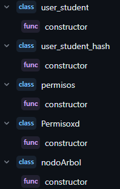
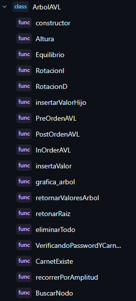
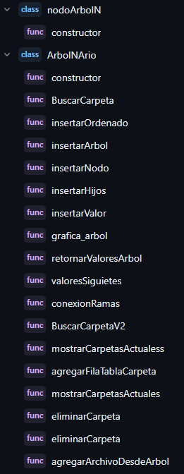
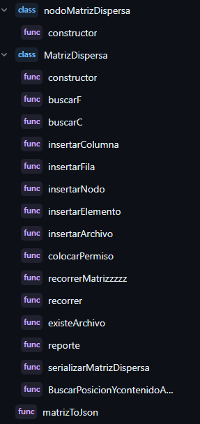
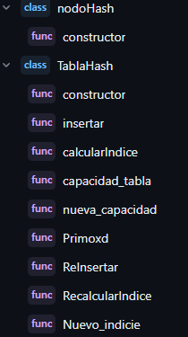
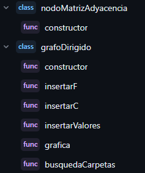

# MANUAL TÉCNICO 🖥️
# FASE 3 DE PROYECTO DE ESTRUCTURA DE DATOS 1S 2023 📁

####  Nombre: Eduardo Jousué González Cifuentes
#### Carnet: 201900647

### CONTENIDO DEL MANUAL

- Introducción 
- Objetivos
- Dirigido
- Especificación Técnica
- Lógica del Programa


## Introducción 📝

>Este manual técnico proporciona una visión general del desarrollo de la página web "EDD GoDrive", una plataforma diseñada para la gestión de carpetas y la subida de archivos. La aplicación web ha sido desarrollada utilizando las tecnologías principales de desarrollo web, como JavaScript, HTML y CSS, y se ha aprovechado la funcionalidad adicional proporcionada por Graphviz.

>"EDD GoDrive" ofrece a los usuarios una interfaz intuitiva y fácil de usar para gestionar y organizar sus archivos en carpetas personalizadas. Además, los usuarios también pueden cargar archivos a sus respectivas carpetas para una mejor organización y acceso. La integración de Graphviz permite una visualización gráfica de la estructura jerárquica de las carpetas y archivos, lo que facilita la navegación y comprensión de la información.

>En las secciones siguientes de este manual técnico, se detallará la lógica del programa, explicando cómo se implementan las funcionalidades principales y cómo se gestionan los datos. Se proporcionará una guía paso a paso para comprender y utilizar eficazmente la página web "EDD GoDrive".


## Objetivos 📝

> - Documentar la arquitectura del sistema: Explicar la estructura general de la aplicación web, incluyendo los componentes principales, la interacción entre ellos y la forma en que se organizan los datos.

> - Describir las tecnologías utilizadas: Detallar el uso de JavaScript, HTML, CSS y Graphviz en el desarrollo de la página web "EDD GoDrive". Proporcionar información sobre cómo se aplican estas tecnologías y su relevancia para la funcionalidad de la aplicación.

## Dirigido 📍

> Este manual va dirigido para todos los desarrolladores que estén interesados en analizar y aprender como se desarrolló esta aplicación.

## Especificación Técnica 💾

> **1. Requisitos de Hardaware**
>   - Computadora de escritorio o portátil.
>   - Mínimo 4gb de RAM.
>   - Procesador i-3 de 4ta generación en adelante.
>   - Mínimo 10 GB de almacenamiento en el Disco Duro. 

> **2. Requisitos de Software**
>   - Windows 7 o superior.
>   - Golang 1.20
>   - Graphviz
>   - Visual Estudio Code

## Lógica del Programa 💽

### Métodos y clases utilizadas para llevar a cabo el desarrollo de la aplicación 🔖
#### Funciones 📁

#### Se utilizaron diversas funciones para el desarrollo de la página web estas son:

<div align="center">

</div> 


<h4>Clase AVL📁<h4>
<h5>En ésta clase está la esctructura del arbol avl donde se guardaron los usuarios en un principios y se utilizó para el manejo de las carpetas y archivos.<h5>

<div align="center">

</div>

<h4>Clase Arbol N-ario📁<h4>
<h5>En ésta clase está la esctructura del arbol n-ario que se utilizó par la creacion de carpetas<h5>

<div align="center">

</div>


<h4>Clase Matriz Dispersa📁<h4>
<h5>En ésta clase está la esctructura la matriz dispersa de cada nodo donde se guardaron los archivos(pdf,imagen,txt).<h5>

<div align="center">

</div>


<h4>Clase Tabla Hash📁<h4>
<h5>En ésta clase está la esctructura la tabla hash la cual fue utilizada para migrar la inforamcion del arbol avl a esta misma.<h5>

<div align="center">

</div>

<h4>Clase Grafo📁<h4>
<h5>En ésta clase está la esctructura del Grafo que se utlizó para guardar la informacion del arbol n-ario.<h5>

<div align="center">

</div>


<h4>Funciones Mas imporantes Para el desarrollo de la aplicación  📁<h4>


##### Login
##### Funcion que sirve para poder acceder al sistema
```javascript
async function Loginn() {
    let user = document.getElementById("useeer").value;
    let pass = document.getElementById("passsword").value;
    let ArbolenStorageLogin = JSON.parse(window.localStorage.getItem("TreeAVL"));
    let hashhhhh2 = JSON.parse(window.localStorage.getItem("TablaHashhh"));
    let passwordEncriptada = await sha256(pass);
    let effect = VerificarEstudiante(user, passwordEncriptada, hashhhhh2);
    let resultado = arbolBinarioAVL.VerificandoPasswordYCarnetDelArbol(ArbolenStorageLogin, user, pass);
    let usuariosArray = JSON.parse(localStorage.getItem("usuarios")) || [];
    let usuariActualdelArray = usuariosArray.find((usuario) => usuario.carnet == user);
    try {
        if (user == "admin" && pass == "admin") {
            // ruta buena en web
            let rutaaaaxx = "../../../../../EDD_1S2023_PY_201900647/EDD_Proyecto1_Fase3/Code/Dashboard/examples/dashboard.html";
            //let rutaaaa = "../../../../EDD_Proyecto1_Fase3/Code/Dashboard/examples/dashboard.html";
            console.log(rutaaaaxx);
            window.location.href = rutaaaaxx;
            window.alert("Bienvenido Admin");
        } else if (effect !== null) {
            console.log("Usuario encontrado en la tabla hash:", effect);


            // ruta buena en web
            let rutaaxd ="../../../../../EDD_1S2023_PY_201900647/EDD_Proyecto1_Fase3/Code/User/examples/user.html";
            //let rutaax = "../../../../EDD_Proyecto1_Fase3/Code/User/examples/user.html";
            console.log(rutaaxd);
            window.location.href = rutaaxd;
            window.alert("Bienvenido Estudiante: " + effect.nombre);
        } else if (resultado !== false) {
            console.log("ArbolStorage: ", ArbolenStorageLogin);
            console.log("Resultado: ", resultado);
            if (usuariActualdelArray && usuariActualdelArray.carnet == resultado.carnet) {
                console.log("Usuario Actual: ", usuariActualdelArray);
                localStorage.setItem("usuarioActual", JSON.stringify(usuariActualdelArray));
            } else {
                usuariosArray.push(resultado);
                localStorage.setItem("usuarios", JSON.stringify(usuariosArray));
                localStorage.setItem("usuarioActual", JSON.stringify(resultado));
                usuariActualdelArray = resultado;
            }

            //ruta buena en web
            let rutaax ="../../../../../EDD_1S2023_PY_201900647/EDD_Proyecto1_Fase3/Code/User/examples/user.html";
            //let rutaax = "../../../../EDD_Proyecto1_Fase3/Code/User/examples/user.html";
            console.log(rutaax);
            window.location.href = rutaax;
            window.alert("Bienvenido Estudiante: " + resultado);
        } else {
            alert("Usuario o contraseña incorrecta");
        }
    } catch (error) {
        alert(error);
    }
}
```

##### ConvertAvlfromLocalStorageToTablaHash
##### Funcion que sirve para convertir el arbol avl que se encuentra en el localstorage a una tabla hash
```javascript
async function ConvertAvlfromLocalStorageToTablaHash() {
    try {
        const tablaHashhhhh = new TablaHash();
        const arbolAVL = JSON.parse(localStorage.getItem("TreeAVL"));
        if (!arbolAVL) {
            throw new Error("El árbol AVL en el almacenamiento local no existe o es inválido");
        }
        const nuevoAVL = new ArbolAVL();
        nuevoAVL.raiz = arbolAVL;
        const nodosAVL = nuevoAVL.recorrerPorAmplitud();
        console.log("Nodos del árbol AVL:", nodosAVL);
        for (let i = 0; i < nodosAVL.length; i++) {
            const password = await encriptarPassSha256(nodosAVL[i].user_student.password);
            tablaHashhhhh.insertar(
                nodosAVL[i].user_student.carnet,
                nodosAVL[i].user_student.nombre,
                password,
                nodosAVL[i].user_student.carpeta_raiz,
                nodosAVL[i].user_student.arbolNario,
                nodosAVL[i].user_student.listaDobleCircular
            );

        }
        const tablaHashEnStorage = JSON.stringify(tablaHashhhhh);
        window.localStorage.setItem("TablaHashhh", tablaHashEnStorage);
        window.localStorage.removeItem("TreeAVL");
        console.log("Tabla hash generada a partir del árbol AVL:", tablaHashhhhh);
    } catch (error) {
        console.error("Error en la conversión de AVL a Tabla Hash:", error);
    }
}
```


##### sha256(mensaje)
##### Funcion que sirve para encriptar la contraseña del usuario
```javascript
async function sha256(mensaje) {
    let cadenaFinal
    const enconder = new TextEncoder();
    const mensajeCodificado = enconder.encode(mensaje)
    await crypto.subtle.digest("SHA-256", mensajeCodificado)
        .then(result => { // 100 -> 6a 
            const hashArray = Array.from(new Uint8Array(result))
            const hashHex = hashArray.map(b => b.toString(16).padStart(2, '0')).join('')
            cadenaFinal = hashHex
        })
        .catch(error => console.log(error))
    return cadenaFinal
}
```


##### VerificarEstudiante(carnet, password, tablaHashInLocalstorage)
##### Funcion que sirve para verificar si el estudiante existe en la tabla hash
```javascript
function VerificarEstudiante(carnet, password, tablaHashInLocalstorage) {
    console.log("Tabla hash en localstorage:", tablaHashInLocalstorage)
    console.log("Carnet:", carnet);
    console.log("Password:", password);
    if (tablaHashInLocalstorage != null) {
        for (let i = 0; i < tablaHashInLocalstorage.tabla.length; i++) {
            if (tablaHashInLocalstorage.tabla[i] == null) {
                continue;
            }
            if (tablaHashInLocalstorage.tabla[i].carnet == carnet && tablaHashInLocalstorage.tabla[i].password == password) {
                console.log("Estudiante encontrado:", tablaHashInLocalstorage.tabla[i]);
                const usuariogg = new user_student_hash(
                    tablaHashInLocalstorage.tabla[i].carnet,
                    tablaHashInLocalstorage.tabla[i].usuario,
                    tablaHashInLocalstorage.tabla[i].password,
                    tablaHashInLocalstorage.tabla[i].carpeta_raiz,
                    tablaHashInLocalstorage.tabla[i].arbolnnario,
                    tablaHashInLocalstorage.tabla[i].listaDobleCircular
                );
                console.log(usuariogg)
                window.localStorage.setItem("usuarioActual", JSON.stringify(usuariogg));
                return usuariogg;
            }
        }
    }
    else if (tablaHashInLocalstorage == null) {
        console.log("Tabla hash vacía");
        return null;
    }
}
```

##### convertirArchivos(archivos)
##### Funcion que sirve para obtener los archivos compartidos
```javascript
function convertirArchivos(archivos) {
    const container = document.getElementById("uwu");

    archivos.forEach((archivo) => {
        const { nombre, contenido } = archivo;
        const extension = nombre.split('.').pop().toLowerCase();

        // Crear un contenedor para el archivo
        const fileContainer = document.createElement('div');

        // Agregar el nombre del archivo
        const nombreArchivoElement = document.createElement('h3');
        nombreArchivoElement.textContent = nombre;
        fileContainer.appendChild(nombreArchivoElement);

        if (extension === 'pdf') {
            // Crear un elemento <iframe> para visualizar el archivo PDF
            const iframe = document.createElement('iframe');
            iframe.src = `${contenido}`;
            iframe.style.width = '100%'; // Redimensionar el ancho del iframe
            iframe.style.height = '500px'; // Redimensionar el alto del iframe
            fileContainer.appendChild(iframe);
        } else if (extension.match(/(jpg|jpeg|png|gif)$/)) {
            // Crear un elemento  para mostrar la imagen
            const img = document.createElement('img');
            img.src = `${contenido}`;
            fileContainer.appendChild(img);
        } else if (extension === 'txt') {
            // Crear un elemento <textarea> para mostrar el contenido del archivo de texto
            const textarea = document.createElement('textarea');
            let nueva = contenido.split("base64,")[1];
            textarea.value = atob(nueva);
            textarea.style.width = '100%'; // Redimensionar el ancho del textarea
            textarea.style.height = '300px'; // Redimensionar el alto del textarea
            fileContainer.appendChild(textarea);
        }

        // Agregar el contenedor del archivo al contenedor principal
        container.appendChild(fileContainer);
    });
}
```


##### ConvertirarbolNarioAGrafoDirigido()
##### Funcion que sirve para convertir el arbol n-ario a un grafo dirigido
```javascript
function ConvertirarbolNarioAGrafoDirigido() {
    let usuarioActuaaal = JSON.parse(localStorage.getItem("usuarioActual"))
    let arbolitoActual = usuarioActuaaal.arbolNario
    let matriz = arbolitoActual.matriz
    let narioAuxialiar = new ArbolNArio();
    let rutaaa = document.getElementById("rutaCarpeta").value;
    console.log("Arbolito Actual", arbolitoActual)
    narioAuxialiar.raiz = arbolitoActual.raiz
    narioAuxialiar.matriz= matriz
    narioAuxialiar.grafos()
    console.log("Nuevo",narioAuxialiar)
    GraFo.busquedaCarpetas(rutaaa);
    //console.log("Nuevo Grafo:" ,GraFo)
}
```