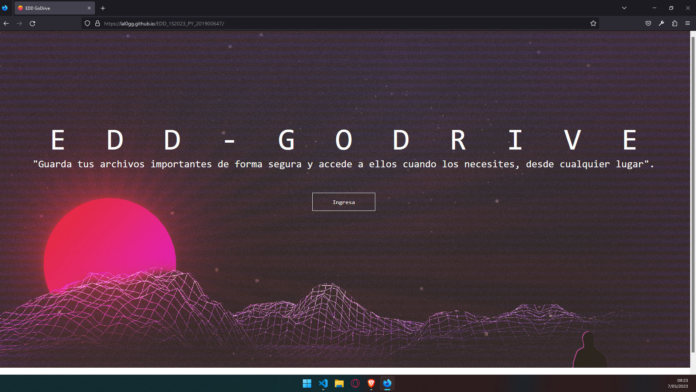
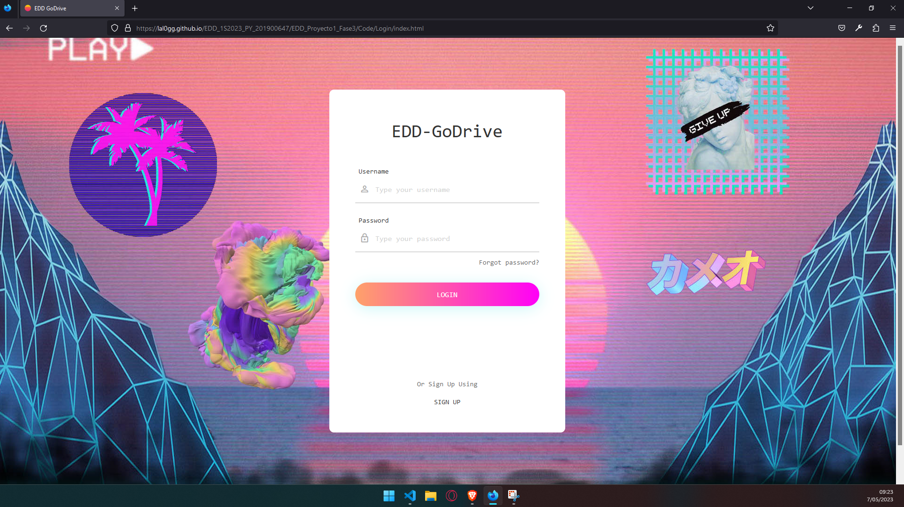
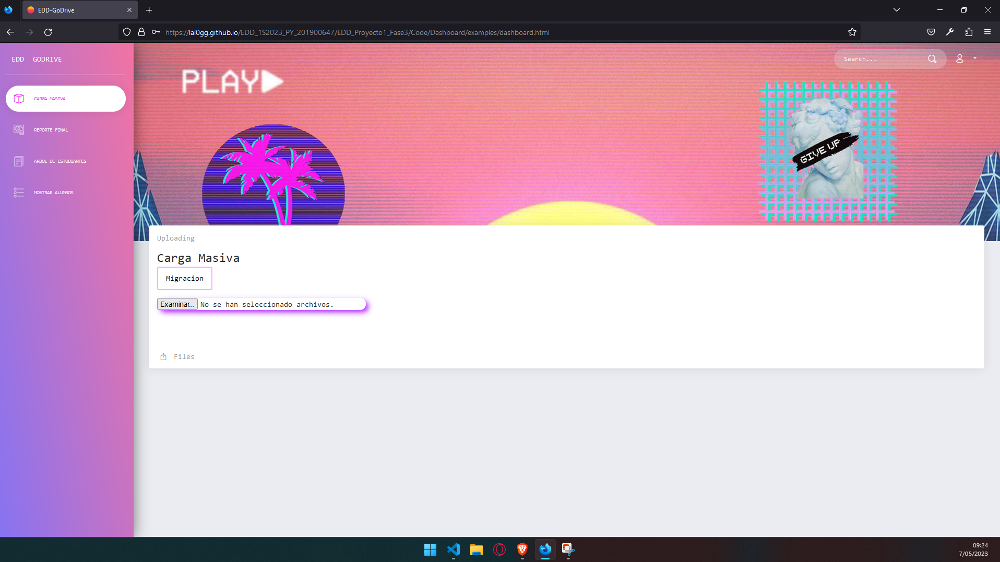
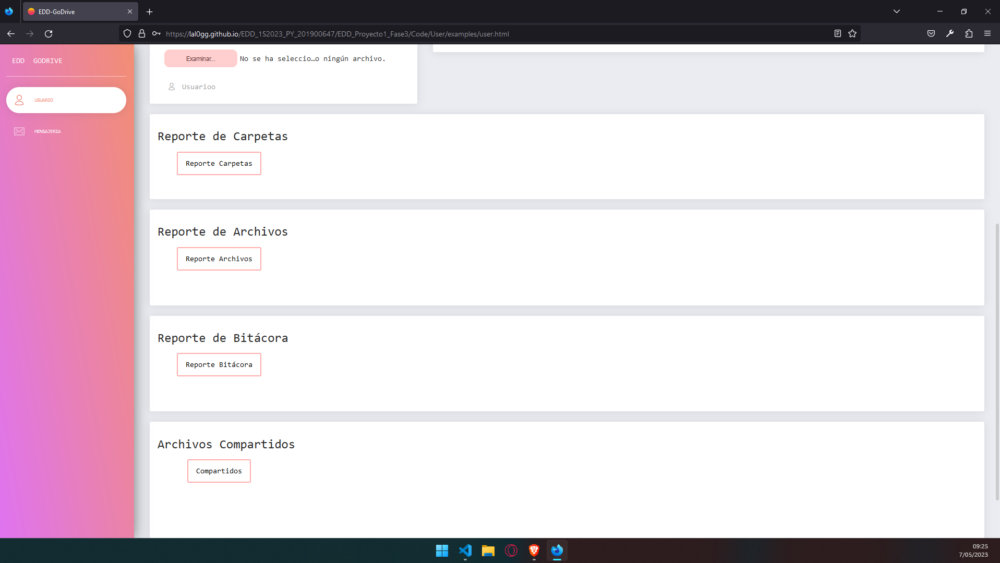

# MANUAL DE USUARIO 🖥️
# FASE 3 DE PROYECTO DE ESTRUCTURA DE DATOS 1S 2023 📁

####  Nombre: Eduardo Jousué González Cifuentes
#### Carnet: 201900647

### CONTENIDO DEL MANUAL

- Introducción 
- Requerimientos
- Opciones de la aplicacion
- Recomenzaciones

# Introducción 📝

>Este manual ha sido creado para proporcionarte una guía detallada sobre cómo utilizar de manera efectiva todas las funcionalidades y características que ofrece "EDD GoDrive".

>"EDD GoDrive" es una plataforma web diseñada para facilitar la gestión de carpetas y la subida de archivos. Con esta herramienta, podrás organizar tus archivos en carpetas personalizadas, subir y descargar archivos de manera segura y eficiente, y visualizar la estructura jerárquica de tus carpetas y archivos.

>Este manual está estructurado de manera clara y concisa, para ayudarte a aprovechar al máximo todas las capacidades de "EDD GoDrive". Encontrarás instrucciones paso a paso, capturas de pantalla y consejos útiles que te guiarán a lo largo de tu experiencia de uso.

>Antes de comenzar, asegúrate de tener acceso a un navegador web actualizado y una conexión a Internet estable. Además, ten en cuenta que se asume un nivel básico de conocimiento en el manejo de aplicaciones web.

>Estamos seguros de que, al utilizar "EDD GoDrive" y seguir este manual, podrás administrar tus archivos y carpetas de manera eficiente, mejorar tu productividad y mantener tus datos organizados de manera segura.

>¡Comencemos a explorar las capacidades de "EDD GoDrive" juntos y aprovechar al máximo esta poderosa herramienta de gestión de archivos!

# Requerimientos💾
> **1. Requisitos**
>   - Computadora de escritorio o portátil.
>   - Mínimo 4gb de RAM.
>   - Procesador i-3 de 4ta generación en adelante.
>   - Windows 7 o superior
>   - Navegador web actualizado (Chrome, Firefox, Edge, Safari, etc.)
>  - Conexión a Internet estable.
> - Conocimientos básicos de aplicaciones web.
> - Conocimientos básicos de manejo de archivos y carpetas.
> 

# Opciones de la aplicacion💾

#### Ingrea a la pagina web de la aplicacion pulsando el boton 

 

#### Ingrea como administrador o como usario

 

#### Módulo adimistrador donde puedes hacer la carga masiva de archivos y la migracion además de acceso a los distintos reportes

 

#### Módulo usuario donde puedes acceder a tus archivos y carpetas además de poder subir archivos y crear carpetas y también a la seccion de reportes

# Recomenzaciones ☝️🥸
>   - Familiarízate con la interfaz: Tómate el tiempo para explorar la interfaz de "EDD GoDrive" y familiarizarte con las diferentes secciones y opciones disponibles. Esto te permitirá utilizar la herramienta de manera más eficiente y sacar el máximo provecho de sus funcionalidades.

>   - Organiza tus carpetas de manera lógica: Establece una estructura de carpetas que se adapte a tus necesidades y te resulte fácil de navegar. Crea carpetas principales y subcarpetas para mantener tus archivos organizados y facilitar su búsqueda y acceso.

>   - Utiliza la función de búsqueda: "EDD GoDrive" ofrece una función de búsqueda integrada para ayudarte a encontrar archivos rápidamente. Aprovecha esta función utilizando palabras clave relevantes o filtros para obtener resultados más precisos.

>   - Sube archivos de forma ordenada: Antes de subir archivos, asegúrate de nombrarlos de manera clara y descriptiva. Esto facilitará la identificación y búsqueda de archivos en el futuro. Además, considera la posibilidad de utilizar una estructura de carpetas adecuada para organizar tus archivos desde el principio.

>   - Mantén tus datos seguros: Utiliza contraseñas seguras para tu cuenta en "EDD GoDrive" y evita compartir tus credenciales con terceros. Además, asegúrate de comprender y utilizar las opciones de privacidad y permisos que ofrece la plataforma para controlar quién puede acceder y modificar tus archivos.